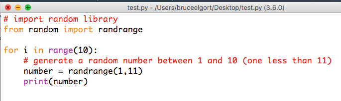

# Module 6 - Problem Set No. 9 Problem 1

## Random Password Generator

**NOTE:** To help you out I created a lot of the code to help you get started. You are welcome :-)

1. Generates a random password
2. Uses functions
3. Uses the Python randrange() function. It's part of the random library. You will need to import it.
4. Your function should be named generatePassword()
5. The function should take the length of the password desired and should be a number between 8 and 42.
6. Your password should contain uppercase, lowercase, the numbers 0-9 and the symbols \*/?-&
7. Your function should return the password that was generated
8. Use string slicing and string concatenation to generate the password
9. Store all of the passwords you generate in a file named passwords.txt.
10. Make sure you don't overwrite data in this file.
11. Your program should also ask the user how many times they want to run the password generator and then loop that many times to generate passwords.
12. Show the program running for 4 different password lengths.

[Here is a video](https://youtu.be/BQRWnjK3tO4) I made a few quarters ago for a different assignment that shows the output of this problem.

## TIPS AND TRICKS

- Uses the Python random.randrange() or random.randint() function. It's part of the random library.
- Here is a code snippet demoing how random.randrange() works:

- Create a variable and assign it a string containing all of the uppercase letters, lowercase letters, the numbers 0-9 and the symbols \*/?-&
- Use string slicing (for the variable created in item 3 above and string concatenation to generate the password
- Open a file using the open() function and set it's mode to "a" (for append)
- Write each password to the file and be sure to include a "\n" with each write. This will create a newline character in the file.
